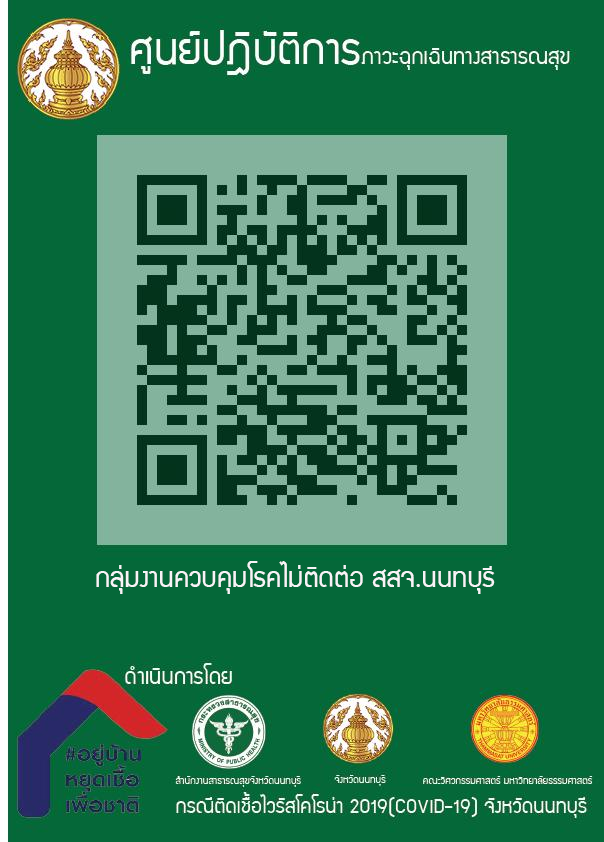

CovidNont is an mobile app developed by Nanthaburi provincial public health office. It is used for monitor the Covid-19 status in Nonthaburi provice, Thailand. Presently (3th April 2020) some shops and workplaces have been allowed to provide their services. However all people who live in, visit or work in Nonthaburi province and want to access those services need to provide selves information. The information include name, phone number, if he/she is service provider or customer, and if he/she has got a fever.

Those information is used only for monitoring the status of Covid-19 spread in Nonthaburi province for public benefit.
The privacy policy is [here](policy).

This is QRcode that shops/services providers have.

[The video how the use](./doc/use-video-20200504-a.mov)

---
by [Nonthaburi Provincial Public Health Office](https://ssjnonthaburi.moph.go.th/nont/) 
https://ssjnonthaburi.moph.go.th/nont/ 
Bang Krasaw, Mueang Nonthaburi District, Nonthaburi 11000 
TEL: 02 950 3071
